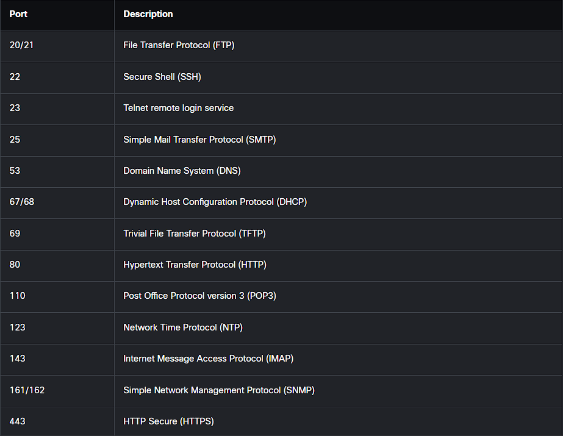

- Los puertos son identificadores pero para quien? para cualquier aplicación o servicio que corra en nuestra computadora, cuando se inicia cualquier cosa en nuestra pc a esto se le asigna un puerto para que puede interconectarse con otra cosas.
- Los puertos pueden tener 3 estados:
- open: el puerto esta abierto y en uso, por lo tanto se puede establecer comunicacion con la aplicación/servicio
- closed: el puerto no esta siendo utilizado por nada y esta cerrado, imposible establecer comunicacion.
- blocked/filtered: el puerto esta abierto y en uso pero esta bloqueado debido al firewall.
- Aunque un servicio / [[Software]] puede vivir en cualquier puerto hay algunos que se han vuelto estándar y ya solo son utilizados por ciertos servicios específicos estos se conocen como puertos conocidos.
  
- Una computadora puede tener hasta 65.000 puertos activos?!. alv como voy a aprenderlos todos?, no es necesario ya que como dije mas arriba un software puedo estar en cualquier puerto, además el 75% de los ataques cibernéticos ocurren en unos pocos [[Puertos Propensos A CiberAtaques]] y si ya manejas una política restrictiva que mantiene la mayoría de puertos cerrados no tendras de que preocuparte por la mayoría de estos.
- Estos se dividen en 3 categorías:
	- Well-Know Ports (0-1023)
	- Registered Ports (1024- 49151)
	- Dynamic / Provate Ports (49152 - 65535)
- [[Nmap]] el poder de los puertos en tus manos.
- Otro gran software para ver todos los tipos de conexiones activas al momento es [[Netstat]]