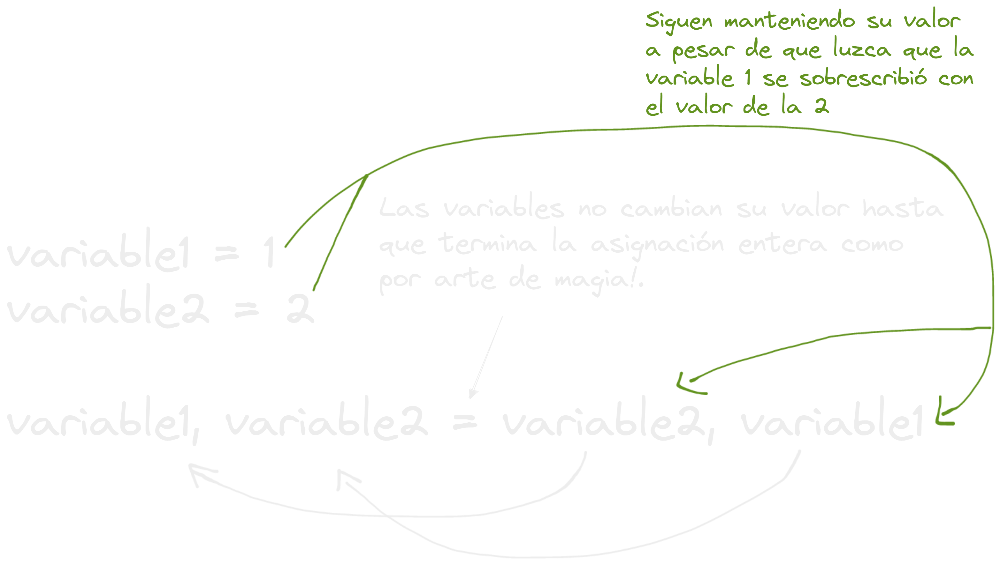

- Python tiene muchas cosas pero uno de sus fuertes para mi son las arrays dinámicos, o mas bien arrays falsos con cosas pasando under the hood pero que los hacen extremadamente poderosos llamados [[Listas]]
- Hacer un intercambio de valores entre variables sin una variable auxiliar?! que me estas contando lucas como se hace?! #card
collapsed:: true
	- en python en vez de hacer la típica de:
	- ***Intercambio de valores entre variables con variable auxiliar*** #code
	  ```python
	  variable1 = 1
	  variable2 = 2
	  
	  auxiliar = variable1
	  variable1 = variable2
	  variable2 = auxiliar 
	  ```
	- con python tu puedes hacer esto!
	- ***Intercambio de variables mágico!*** #code
	  ```python
	  variable1 = 1
	  variable2 = 2
	  
	  variable1, variable2 = variable2, variable1 
	  ```
	- 
- Así que python también tiene funciones anónimas? llamadas [[Lambda Functions]]