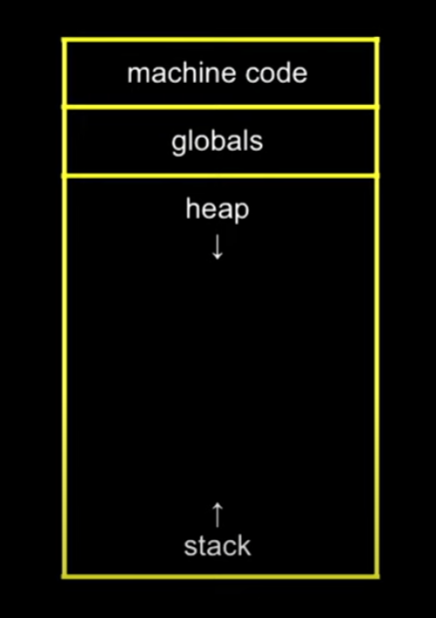

- Ram works like this:
	- 
	- in the beginning it will load any code of any program that was compiled and is needed at the moment
	- after that come the global variables of those programs
	- after that come the memory chunks that are reserved in something called the [[Heap]] with a function like malloc.
	- and finally local variables and functions and stores in something called the [[Stack]]
	- You can see this isn't unlimited so if you use more and more of any of those last two you will crash with the famous stack overflow error!