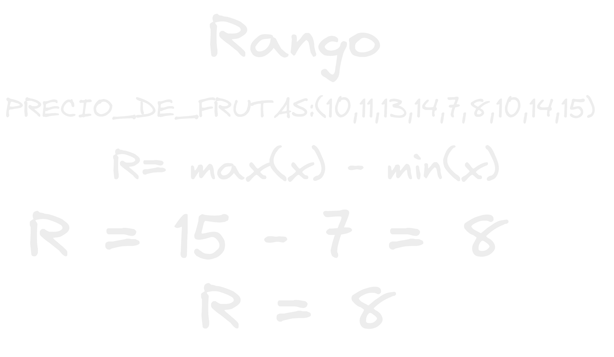
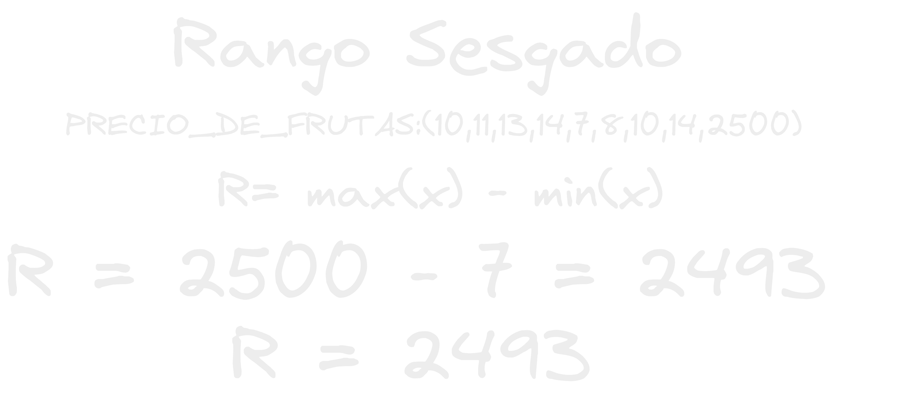
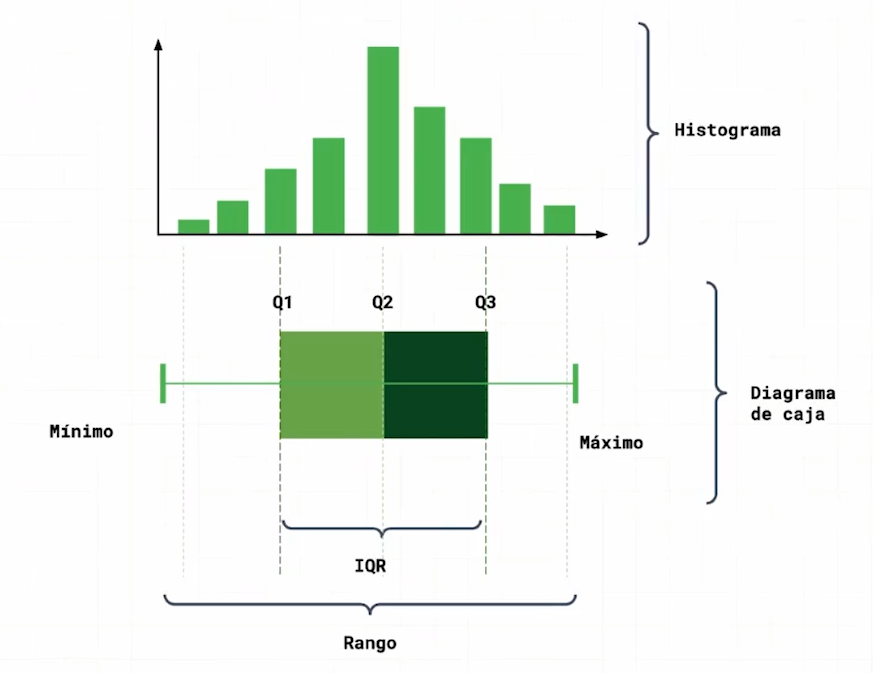

- el rango es un estadístico descriptivo bastante fácil de conseguir el cual nos puede dar una idea resumida de que tan lejos están los datos.
- Lo conseguiremos simplemente restando el dato con el valor mínimo del dato con el valor máximo en un conjunto, así podremos tener una idea de que tanta distancia ahi entre los elementos, pero al igual que las [[Medidas De Tendencia Central]] estas tienen sus inconvenientes que pasa si tenemos 100 datos que son muy parecidos y uno que por alguna razon vale 10 veces mas que todos los demás? eso seguramente alteraría mucho la interpretación del rango ya que pensaríamos que la dispersion/ distancia entre los datos es mucho mayor a lo que en realidad es:
- Por ejemplo:
  
- Como puedes ver arriba obtenemos un rango no muy alto de 8 por lo que podríamos intuir que los datos no están muy dispersos.
- Pero que pasa si se nos cuela un valor atípico?
- Por Ejemplo:
  
- como podrás observar arriba un elemento con un valor muy superior se ha colado y ha cambiado totalmente lo que representa nuestro rango, ahora con un valor de 2493 pensaríamos que los datos están bastante mas dispersos de lo que realmente están, como puedes ver todos excepto el mayor son números pequeños de 2 cifras menores a 20! y pensaríamos seguro que hay números con valores de cientos o miles entre los datos!
- Para evitar estos sesgos se crearon mediciones mas especificas y detalladas como lo es el rango intercuartil el cual se compone del espacio entre el cuartil 3 y el cuartil 1 pero que son los cuartiles?
- Los cuartiles simplemente son las fracciones que quedan al partir un conjunto de datos de manera homogénea en 4 partes a que su nombre es bastante intuitivo?
- Con el rango intercuartil/IQ podremos evitar sesgos en el rango.
- Al definir los cuartiles por medio de la [[Mediana]] los datos ya estarán ordenados y así agarrando solo la porción/rango intercuartil como referencia nos aseguramos que no habrán datos muy dispares en esa porción, mientras nos aseguramos que también es una porción muy representativa del conjunto.
- {:height 357, :width 452}