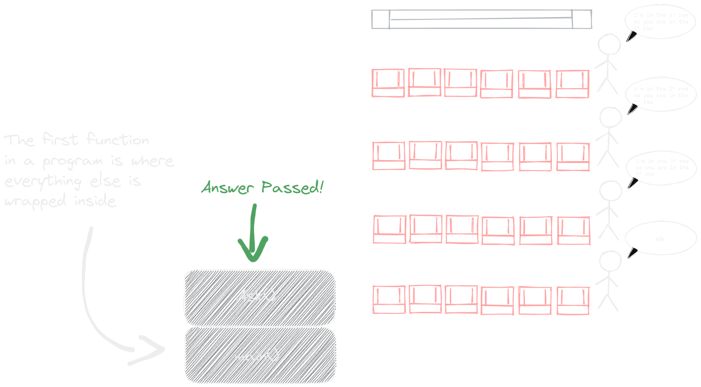
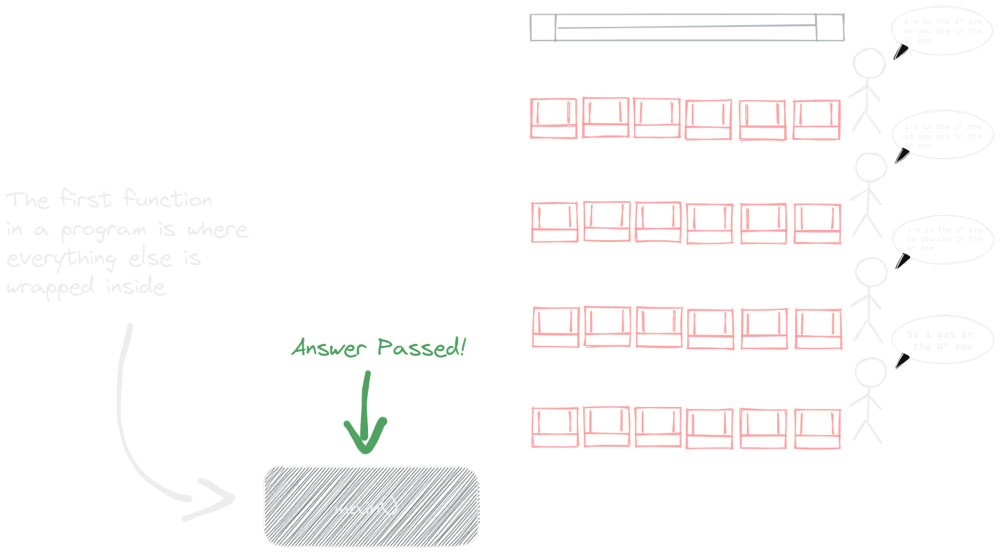

- The magic of call a function inside another, is like you ask to person in front of you in the cinema about in what row you are but that person doesn't know either so before answering you, that person ask to the next row person the same, but that person doesn't know either so the questions follow and follow again and again until the question reach a person that have no more people in front so surely that person row is the first row so for first time [[Base case]] you find an answer with that this person will answers to the previous row person that ask him and person will answer to the previous person and sequentially the answer will reach you.
- YO-YO ANALOGY
	- so like a yo-yo that turn and turn until the end of the string and after that come back to the beginning, the process of [[Recursion]] to get the answer for a problem will "make something" and "make something" until it found the answer or a limit ([[Base case]]) and will come back with that answer!
	- 
- See this:
  collapsed:: true
	- 
	- 
	- 
	- 
	- {:height 419, :width 744}
	-
	- 
	-
	-
	- 
	- 
	- 
	-
	-
-