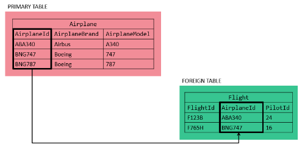

- Make its relationships with a common column in two or more tables, literally the concepts of primary key and foreign key means that, you have a column in a table (primary key) but that same column is present in another table (foreign key) like twins.
  