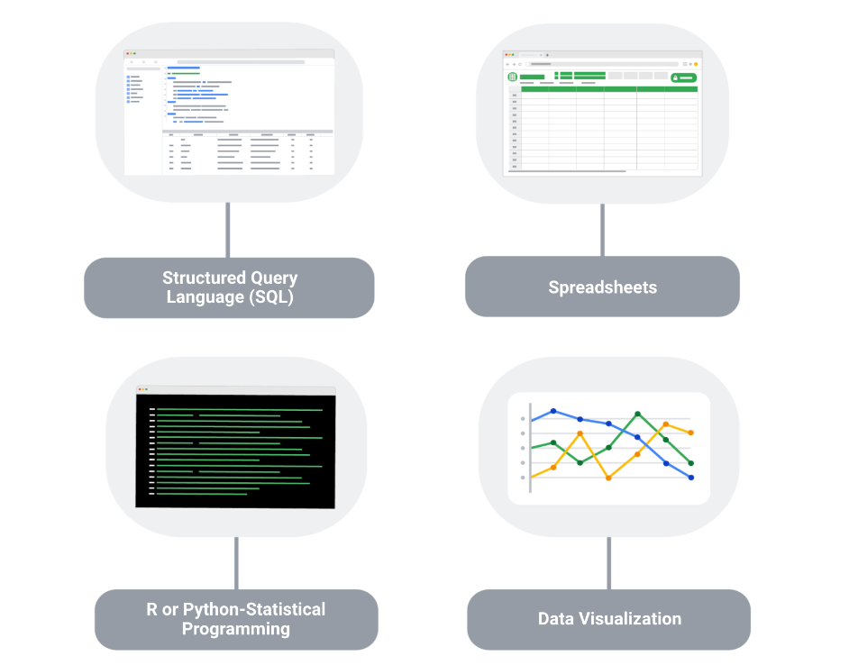

- Un resume / CV / Curriculum, tiene muchos nombres pero al final no es mas que un documento que resume tus habilidades para los reclutadores algunos consejos son.
- que no pase de una hoja
- que este primero la información de contacto
- que cada punto que quieres expresar este resumido, habilidades técnicas y blandas, experiencias laborales o educacionales cualquier cosa. Para este punto en especifico existe una estrategia llamada [[PAR Statements]]
- las habilidades técnicas clave para un analista de datos junior suelen ser:
  