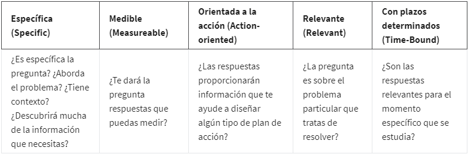

- 
- **Specific**: preguntas simples, importantes y enfocadas en un solo tema o grupo de temas e ideas relacionadas.
- **Measurable**: preguntas que pueden cuantificadas y evaluadas.
- **Action-oriented**: preguntas que alientan la toma de accion y hacer cambio.
- **Relevant**: preguntas que son realmente importantes para nuestro problema que no tener una respuesta ha esta nos esta deteniendo o hasta no dejándonos dormir.
- **Time Bound**: preguntas que especifiquen un periodo de tiempo, esto ayuda a limitar el rango de tiempo de nuestro problema, es mucho mejor preguntar porque han subido las ventas el ultimo año? a preguntar porque han subido las ventas?
- 