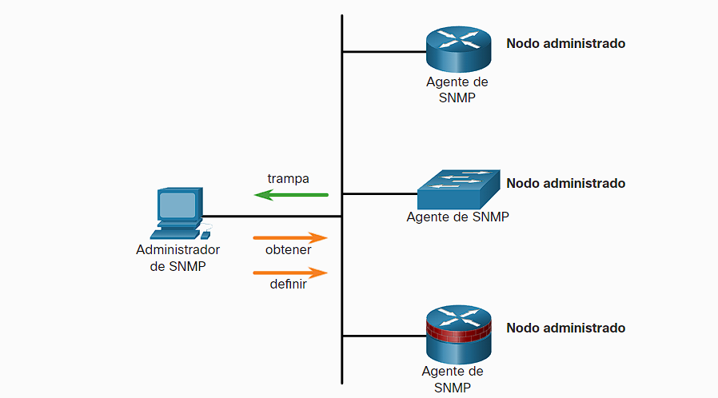

- Protocolo simple de administración de redes o (SNMP) le permite a los administradores gestionar todos los demas dispositivos de red como routers, switches y otros [[Sistemas De Seguridad De Redes]].
- Este funciona a partir de administrador y agentes, el administrador puede obtener o modificar informacion de los agentes y estos también pueden capturar datos entrantes y enviárselos directamente al administrador.
  