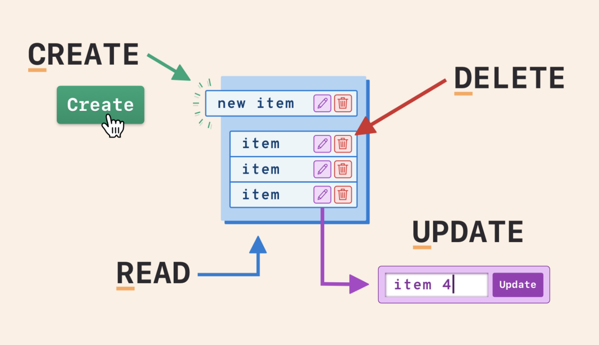
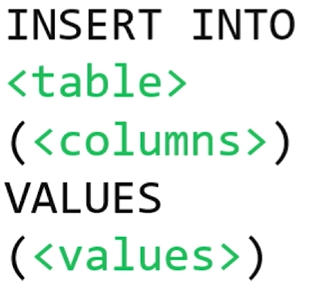
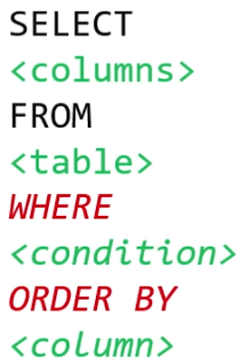
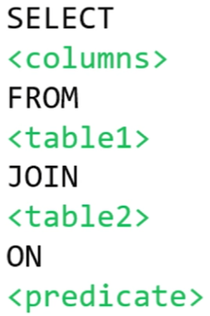
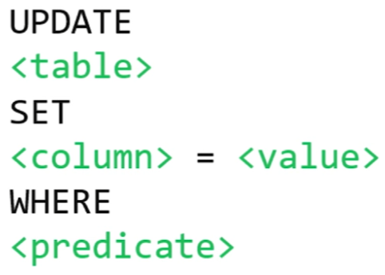
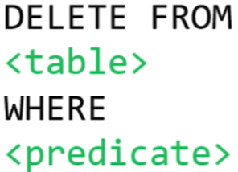
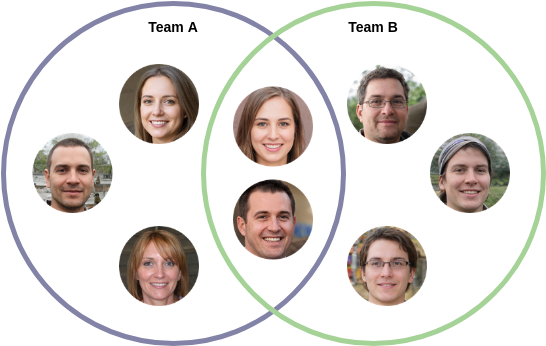

- The most important thing that SQL does is CRUD
  collapsed:: true
	- 
- SQL is a language for [[Relational Databases]]
- SQL Templates
  collapsed:: true
	- INSERT
	  
	- SELECT
	  
	- SELECT (JOIN)
	  
	- UPDATE
	  
	- DELETE
	  
- How you can use values from multiple tables to get specific data in SQL? #card
- you can do it through 2 ways:
- ***SQL Nested Query*** #code
  ```sql
  SELECT something FROM some_table
  WHERE something = (SELECT something from some_table WHERE someting = "something") --'mini nested query'
  ```
- With a nested query you first do a query to a table to get a value that you need to find something in the principal one.
- ***SQL Join Tables With A Column In Common*** #code
  ```sql
  SELECT tablename.sometinhg FROM some_table
  JOIN some_table ON something = tablename.something WHERE tablename.something = "some"
  ```
- With this you merge multiple tables that have a column in common (primary key / foreign key) like the 
  Venn Diagram, in this two person are in both team an that is the bridge to merge or connect the two teams.
  