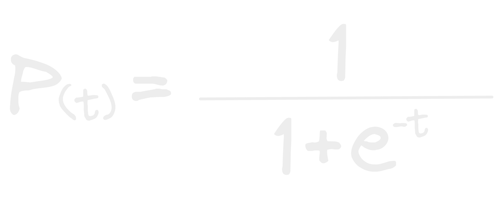

- La fórmula matemática la función sigmoide es:
  
- Bueno ok 1 dividido en 1 + que es esoooooo! D:
- e ? es acaso una variable algebraica normalita, no amigo mío ese es el [[Número e]] y vamos a verlo mas a fondo!