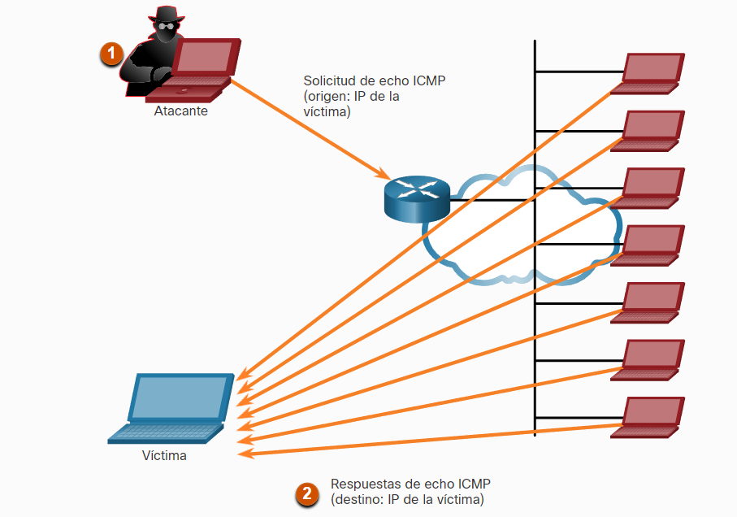

- El spoofing o suplantación es una técnica bastante famosa que puede utilizarse en muchos contextos, literalmente consiste en falsificar la identificación de un dispositivo con esto puede conseguir burlar muchos sistemas de seguridad.
  Estos pueden ser de 2 tipos:
- Blind Spoofing: el atacante no puede ver el trafico entre el usuario que esta suplantando y la victima.
- Non-Blind Spoofing: el atacante puede ver el trafico entre el usuario que esta suplantando y la victima.
- algunos de ejemplos de esto son:
- Falsificar la [[IP]] de origen desde donde viene un petición algo parecido a lo que hacen los vpn.
- Falsificar el ID caller, para mostrar un numero falso al receptor de una llamada.
- Falsificar la [[IP]] de origen de varios paquetes para iniciar un ataque [[DDoS]] hacia un objetivo en particular. Por ejemplo por medio del protocolo [[ICMP]]
  
-