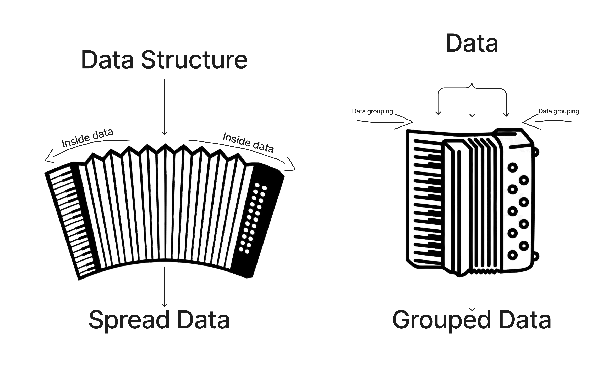

- tanto este operador como su hermano el [[Rest Operator]] se pueden ver como un acordeón:
	- 
- Con este funcionamiento en mente se pueden hacer muchas cosas en varios contextos como:
- ***Copy Array*** #code
  ```javascript
  let frutas = {"fruta2" : "manzana", "fruta1" : "pera" ,"fruta3" : "papaya"}
  let frutas2 = {...frutas}
  // spread the first array in simple data and create a new array with it
  ```
- ***Function group parameters in an array*** #code
  ```javascript
  function print4Fruit(...fruits)
  {
    console.log(fruits)
  }
  
  print4Fruit("manzana","pera","mandarina","papaya")
  // this will print an array containing all parameters that were passed 
  //to the function because they were grouped in an structure with the
  // rest operator
  ```