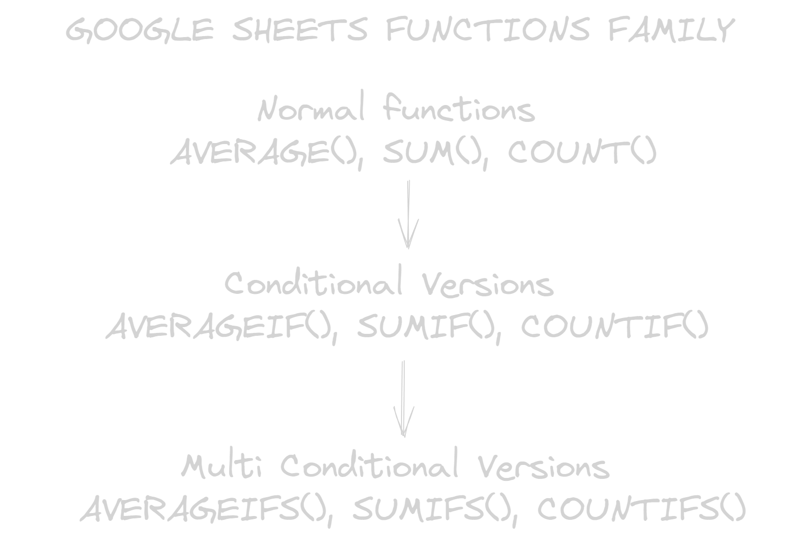

- Básicamente un grupo de instrucciones para abstraer una acciona como en la [[Programación Funcional]]
- Aqui es cuando las cosas se ponen chidas con las spreadsheets
- también se invocan con el signo =
- [[Useful Functions]]
- Estas funciones en especial las de Google Sheets, aunque seguramente Excel no sea muy diferente parecer tener esta estructura:
  