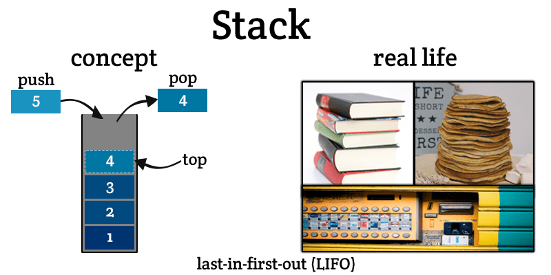

- the stack is a part of memory where static variables (memory spaces declared with a name) are allocated, further it allocated the functions calls (space that is allocated in memory to a function make its work) too.
- the stack works literally like an stack so system starts allocating memory from bottom to top 
  
- with function calls the behavior is the same the last function called is the first that will be active and doing its work until it finish, and when that happens the next function in the stack will begin its job.
- But what happens if you call a function at the half of another one that isn't finish it's job? #card
  card-last-interval:: 4
  card-repeats:: 1
  card-ease-factor:: 2.6
  card-next-schedule:: 2022-03-08T20:43:06.845Z
  card-last-reviewed:: 2022-03-04T20:43:06.848Z
  card-last-score:: 5
	- that will be frozen the current function in that point without deleting or resetting something and the new function that surely is at the top of stack will start it's job and when it finish its job, the previous one will unfrozen an continue its job at the same point where it stopped, so thanks to this the magic of [[Recursion]] happens.