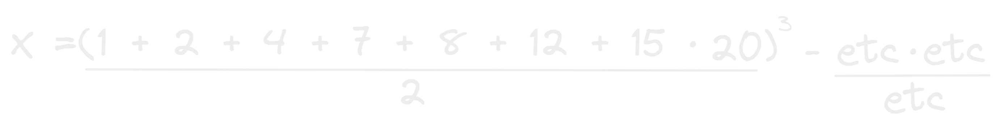
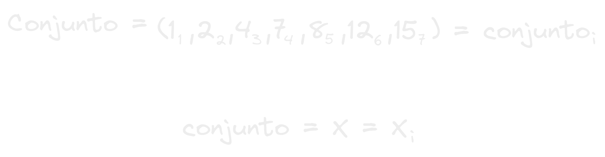

- Las sucesiones [[Matemáticas]] no son mas que conjuntos de números.
- 
- Pero te imaginas tener que escribir todos los elementos de la sucesión en operaciones matemáticas mas avanzadas?
  
  La operación comienza a hacerse enorme! ahora imagina eso con un conjunto de miles o millones de elementos!
- para eso los matemáticos en su increíble forma de pensar inventaron otra forma de anotar una sucesión matemática.
  
- Como puedes ver arriba se basa en darle un nombre al conjunto y luego colocarle una letra que representara el índice de cada uno de los elementos del conjunto, como podrás intuir es igual a la lógica de los [[Arrays]] y como se identifican los elementos en la memoria de la computadora a base de indices x = array[ i ]!
- Y esto combinado con la notación de [[Sumatoria]] crean la perfecta combinación para resumir grandes cantidades de numero en poco espacio.