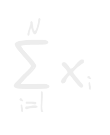
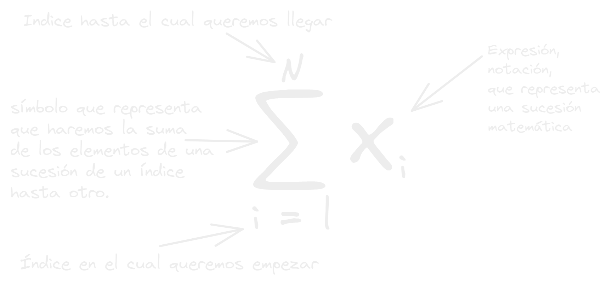
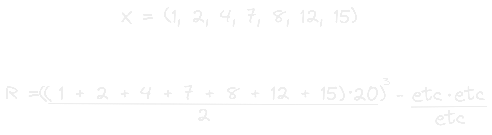
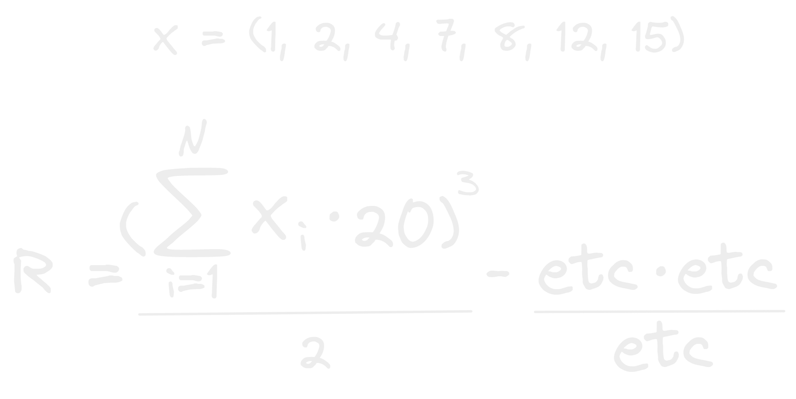

- Hay la sumatoria esa extraña M girada que apenas la ves te recuerda ha algo que haría Albert Einstein.
  
- pero esa sensación de miedo de donde viene? acaso realmente es tan desafiante?, es culpa de la mala educación matemática de la escuela?, es culpa de las series o películas que viste cuando niño?
- Bueno en realidad es muy simple y se nota que es parte de las bases con la que construyeron la programación es increíble!.
- Primero que significa la X con la i chiquita? hay estamos representando una [[Sucesión]] matemática con una notación que la resume.
- ahora que tenemos eso claro que significa la M girada con cosas arriba y abajo?:
  
- Como puedes ver es muy simple! solo representa la suma para adelante de una sucesión o grupo de números de un índice a otro!
- Con esta notación podemos resumir muchas números  en un espacio muy compacto!
- Mira esta operación matemática de la forma tradicional:
  
- Ahora mira la sumatoria en acción!:
  
- ves como se redujo la operación? aquí estamos definiendo que vamos a comenzar a sumar para adelante desde el índice 1 hasta el ultimo que seria N que en este caso seria el numero de elementos en el conjunto, y el conjunto lo definimos con X y una i pequeña como viste mas arriba en la notación de una sucesión.
- Eso es lo que hace la temible M girada! a que te recuerda como funcionan los ciclos en programación y como se va iterando una estructura de datos índice por índice!