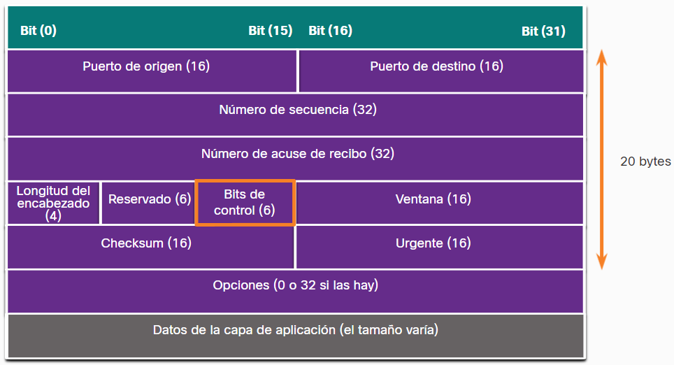

- Is an unique number that represents what type of service/program the data you are sending or receiving belongs.
- Wow tcp ensure that all the information you send or receive to be complete too, it is the man that watch over all the little data packets that travel in the internet around the world and make sure no one packet of information get lost!.
- it gives the [[IP]] address a port the identifies that specific program or service in the dispositive. so that is what exactly a port is wow!
- También cuenta con un control de flujo para evitar congestiones de red.
- Se utiliza cuando se necesitan conexiones seguras, este no envía ningún dato hasta que la conexión esta totalmente establecida.
- El encabezado del protocolo TCP en un [[Packets]] se ve así:
  
- Al muchas aplicaciones utilizar este protocolo para la intercomunicación los atacantes aprovechan las [[Vulnerabilidades TCP]] para atacarlas.