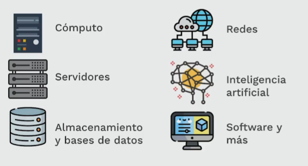

- La nube no es mas que una abstracción de muchas cosas, desde tecnologías pasando por infraestructuras hasta organización o estrategias geográficas, si hablamos de algo mas tangible serian centros de datos que no son mas que cientos de computadoras conectadas con su respectivas necesidades cubiertas a las cuales podemos acceder desde cualquier parte gracias a internet y en donde ya podemos utilizarlas para cualquier cosa que haríamos en una computadora convencional.
  {:height 347, :width 629}
- Al ser tan amplia en lo que puede ofrecer, la nube es como una heladería con un montón de sabores y presentaciones lo que se llama [[Modelos De Servicio]]
- También la nube tiene 3 tipos según lo que necesite una organización:
- 1. Pública
  2. Privada
  3.Híbrida
- Hay varias nubes una de las más grandes es la de [[Azure]] la nube de Microsoft.
- Imagina que para cada servicio o producto que necesite una persona, un servidor web, o un servidor de base de datos, o un pc remoto, o el backend de una app móvil, para cada uno Azure tuviera que comprar o montar una computadora y colocarla en algún sitio, con la demanda de hoy en día, los centros de datos serian colosales, terriblemente gigantes, menos mal eso no es un problema ya que desde hace ya mucho se desarrollo una técnica que la nube utiliza mucho la [[Virtualización]]