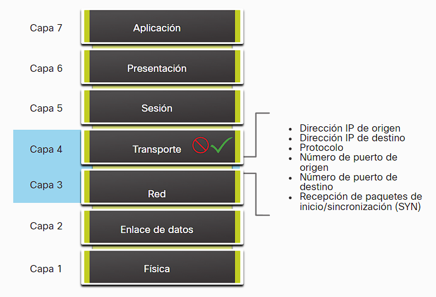

- Estos se pueden instalar tanto en a nivel local/usuario como a nivel de red/grupo:
- También existen de muchos tipos diferentes los cuales interactúan y toman decisiones según la informacion que venga en diferentes [[Capas de Red]]:
- **Firewall de filtrado de paquetes (sin estado o conexión)**: El cual utiliza informacion de la capa 3 y 4 junto con políticas especificas para filtrar el trafico.
  
- **Firewall de filtrado de paquetes (activo)**:  utiliza la capa 3, 4  y 5 mientras también mantiene conexión con una tabla de estados.
- **Firewall del Gateway de aplicaciones**: se utiliza un proxy como intermediario para hacer una conexión segura a un servidor remoto, filtra el trafico de la capa 3,4,5 y 7.
- **Firewalls de próxima generación (NGFW)**: firewalls que incluyen funciones de seguridad mas avanzada.
- aunque existen muchos tipos también muchos firewall hacen cosas en común aqui puedes ver algunas [[Acciones comunes de un Firewall]]