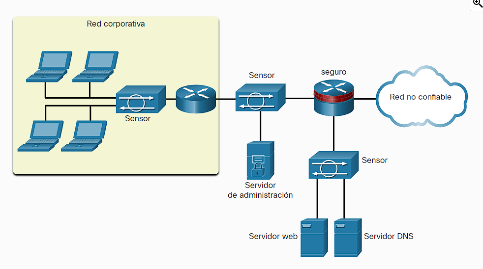

- existen 2 tipos principales:
- **HIPS (IPS con base en el host)**: como su nombre lo indica protege al host su sistema operativo y funcionamiento de comportamientos sospechosos a nivel local.
- **HIPS (IPS con base en el host)**: como su nombre lo indica protege toda una red en vez de solo al host, estos son los que suelen utilizarse a nivel corporativo ya que aumenta la protección contra ataques al tener en cuenta todo el contexto de la red, este tipo en ves de desplegarse en un host se puede desplegar en varios puntos de la red en un dispositivo independiente o en algunos que ya estén en la red.
  
  En la imagen puedes ver los dispositivos IPS en forma de sensores.