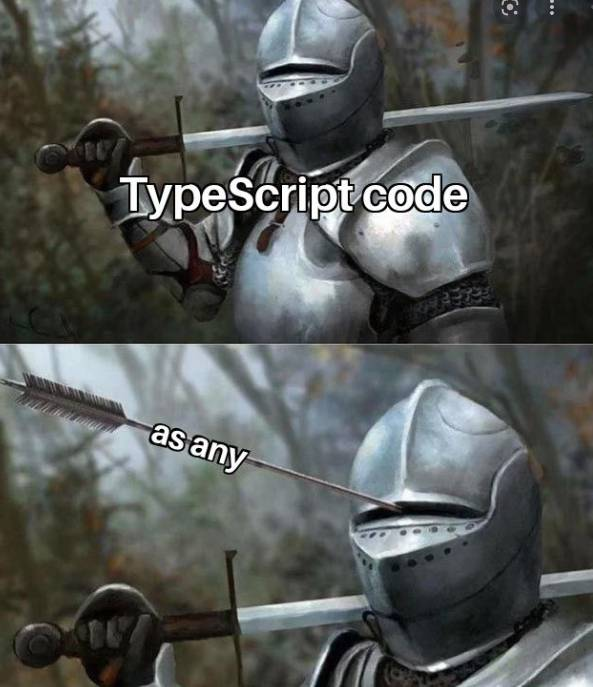

- A que prevenir bugs desde antes de ejecutar el código suena bien?
- [[JavaScript]] con super poderes?
- Las principales habilidades de [[TypeScript]] son encontrar posibles errores desde antes de ejecutar el código y colocar tipado a [[JavaScript]] para controlar el poder que da JavaScript a comparación de otros lenguajes con tipado fuerte nativo, algo que comienza guardando un string puede pasar a ser un número y al final del programa a ser un objeto, lo que puede llevar a errores en algún momento, con typescript todo va a tener un tipo definido con eso se puede tener un software a mi aparecer menos flexible a la hora de pensar en una solución o hasta menos elegante talvez?. pero se logra dar con una solución mucho más segura y estable que es lo más importante cuando se habla de [[BackEnd]].
- ese control se logra con el Type Annotation!
- ***Type Annotation*** #code
  ```typescript
  let fruta : string = "manzana"
  			// ahora sabemos que fruta es una variable que guarda strings
  ```
- Parece ser que el tipo any es lo peor!, úsalo solo como solución temporal mientras arreglas el error real o si la librería que estas usando no tiene soporte para TypeScript.
  collapsed:: true
	- 
- algo buenísimo son los union types con ellos ganas la flexibilidad perdida sin perder el control.
- ***Union Type*** #code
  ```typescript
  let fruta : string | null = "manzana"
  	// con esto ahora fruta puede ser un string como manzana o no 
  	//contener nada osea null
  ```
- con typescript también puedes crear tu propio tipo de dato combinando varios en uno solo como las struct [[C]] parecido pero no igual, lo que mas me sorprendió es que estos custom types pueden ser literales ósea pueden ser algo en especifico y solo eso como un select de [[HTML]] con sus opciones donde solo se pueden seleccionar lo que esta dentro de sus opciones bien definidas.
- ***Custom Type With Literal Options*** #code
  ```typescript
  type fruta = "manzana" | "banana" | "coco"
  let unafruta : fruta = "naranja"
  			// esto dara error ya que ahora las unicas frutas que puede contener
  		// una variable de tipo fruta son las definidas literalmente en el tipo fruta.
  ```
- null y undefined son tipos de datos independientes aunque uno podría pensar como tengo un numero que esta indefinido al principio pero luego ya tendrá un valor eso dará un error en typescript la manera de hacer eso seria crear un dato mixto de number y null o algo así, además de ello es bastante extraño que el motor de inferencia le asignara a las variables que tengan null o undefined el tipo de dato any lo que tiene sentido ya que si lo piensas bien es muy extraño que quieras algo que se mantenga null por siempre por eso le agrega el any para que cambie por cualquier cosa durante el runtime.
- en typescript también se puede o mejor se debe poner que tipo de dato sera el de cada parámetro de una función esto debo admitir que si me parece muy buena idea para evitar llamar un función con malos parámetros o parámetros incompletos y que se rompa todo el código, también es muy bueno que se pueden definir que parámetros serán opcionales solo falta ver como hacer para poder parámetros predeterminados y quedaría la santa trinidad control de parámetros para no romper todo, parámetros opcionales y parámetros predeterminados.
- ***Optional Parameters with Types*** #code
  ```typescript
  const howManyFruitsDoYouHave = (
  fruit : string,
  quantity?: number    
  ) => {
    console.log(`you have $(quantity) ${fruit}s`)
  }
  howManyFruitsDoYouHave("banana", 3)
  // this fuction will ask for two parameters but the first only can be a string
  //and the second only can be a number but its optional so the result would be
  //you have 3 bananas
  // and with this one
  howManyFruitsDoYouHave("banana")
  // you have undefined bananas
  // must be a way to put default params on a function!
  ```
- aja! mi viejo amigo ha regresado void! con que definir que es lo que devuelve una función que tiempos aquellos donde decía wtf [[C]] que es esto?, ahora después de haber programado por más de un año entiendo lo catastrófico y molesto que puede ser no saber exactamente que devuelve exactamente una función, con typescript se puede definir que va a devolver exactamente una función y hasta colocar el viejo void con el cual se define que la función no devolverá nada.
- ***Types on Functions*** #code
  ```typescript
  const sum = (number1 : number , number2 : number) : number => {
    return number1 + number2
  }
  // ok this is simple but in this you can only return a number a nohting more
  // thats really helpful when you cast multiple times between types in a function
  const sum = (number1 : number , number2 : number) : void => {
    console.log(number1 + number2)
  }
  // and with this you cannot return nothing so you can avoid return unnecessary things
  //or from the beginnig define that this function will be for shoot others that will
  // return the job that you need to another place.
  ```
- Oh my god ahora se se vino lo chido el primo lejano de las estructuras de [[C]] que literalmente aquí seria definir un tipo personalizado como un objeto con diferentes propiedades y como cada propiedad/variable tiene que tener su propio tipado bum ahi tenemos una estructura que solo puede ser de cierto tipo!
- ***Custom Object/Struct*** #code
  ```typescript
  type Vote = "positive" | "negative"
  type StructSibling = {
    name : string,
    content: string,
    personVote: Vote
  }
  // now everytime you define a variable
  let box : StructSibling = //this has to fulfill the type of structure that you define
  // or you use it as a parameter
  const makeSomething = (param : StructSibling) => {
    return
  }
  makeSomething(param // must be equal to the type of structure you create
                //with all its properties/values
                )
  ```