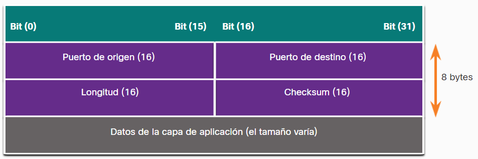

- UDP es un protocolo de transferencia de datos hermano de [[TCP]] pero a diferencia de este es menos seguro no cuenta con ninguna encriptación de forma predeterminada, no garantiza la entrega en orden de los paquetes ni tampoco un sistema para saber si los datos fueron alterados en su trayecto, ni tampoco un sistema para evitar la congestión de la red, pero entonces para que se usa? pues al no contar con estas cosas también lo hace mas rápido con lo cual se aplica en contextos donde la velocidad es mas importante que lo demas como streaming o videojuegos en linea.
- Aunque se cataloga como poco confiable esto no quiere decir que la aplicaciones que lo usan son pocos confiables, esto quiere decir que esas aplicaciones decidieron hacerse cargo de la seguridad en otras [[Capas de Red]] a cambio de obtener los beneficios de velocidad de UDP.
- Un encabezado UDP se ve comúnmente así:
  
- Veamos las [[Vulnerabilidades de UDP]]