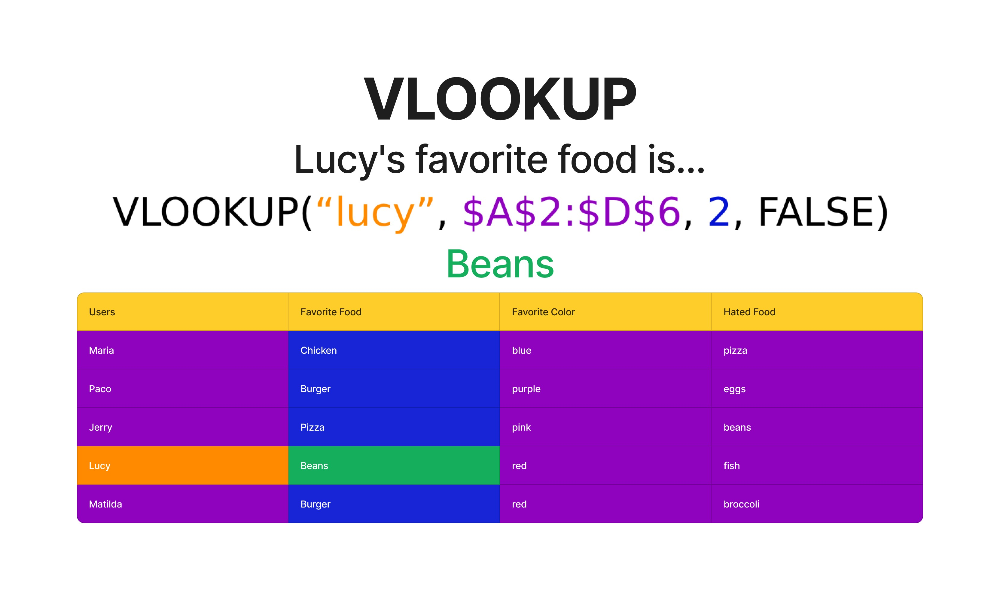

- **VLOOKUP**:es una función bastante rara si te tengo que ser honesto así es como funciona
  Es una función que busca en la primera columna de un rango especifico la fila que contenga un valor especifico y teniendo la fila podemos obtener cualquier valor de sus columnas adyacentes ósea aquellas que estén a la derecha.
  Puedes ver un ejemplo visual de esto aqui para que te quede mas claro:
	- {:height 613, :width 1008}
- Esta función por como esta creada tiene 2 principales limitaciones como solo busca en la primera columna del rango seleccionado no podemos obtener valores que estén a la izquierda ya que estos estarían fuera del rango seleccionado, la segunda es que devuelve la primera final que cumpla la condición entonces si estábamos pensando en otra fila con el mismo valor no podremos llegar a ella, por lo que veo esta función parece estar pensada para usarse con columnas con valores únicos como las primary key de una tabla en una base de datos [[[SQL]]
- COUNTIF: cuenta la cantidad de veces que esta presente cierto valor en un rango
- SUMIF: suma los valores de un rango que cumplan cierta condición
  ***SUMIF*** #code
  ```Spreadsheet
  =SUMIF(A2:A6, "Manzanas", B2:B6)
  (rango en donde buscar la condicion, condicion, rango que se va a sumar)
  ```
- Estas 2 funciones cuentan con versiones plus donde puedes agregar múltiples condiciones y por lo tanto obtener resultados mas complejos.
- SUMPRODUCT: suma total de todos los productos de una multiplicación de varios arrays