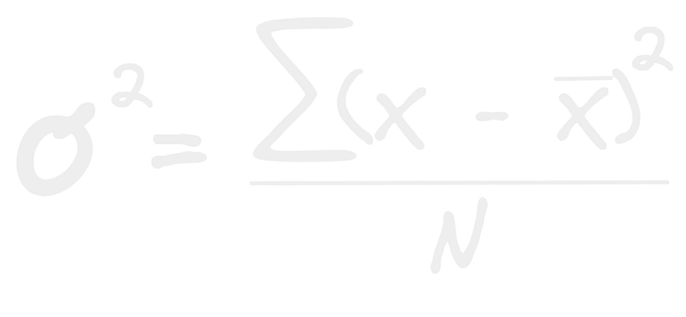
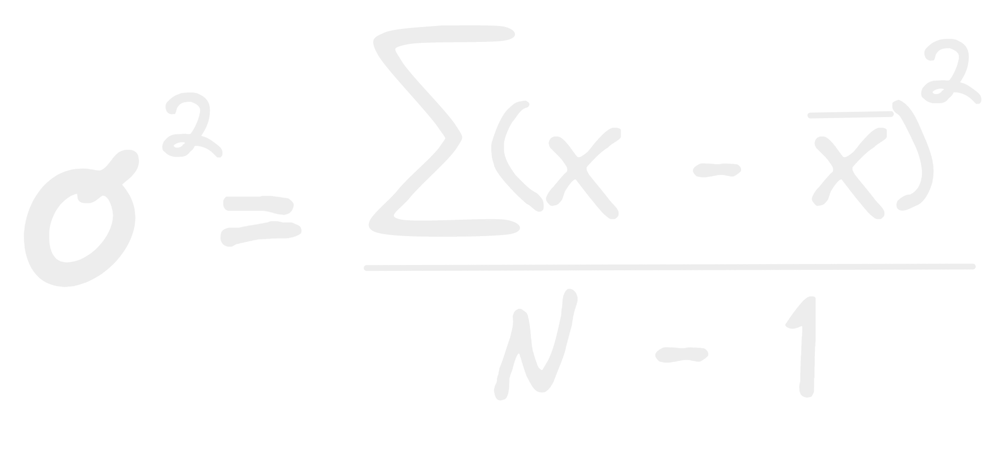

- La varianza tiene 2 formulas diferentes pero muy parecidas según se este hacendó el análisis sobre toda la población o sobre una muestra de esta.
- Si esta es poblacional:
  
- Si es muestral:
  
- Como puedes ver solo cambia a dividir sobre el números de elementos - 1 hay matemáticas mas profundas explicando el porque de ello espero algún día comprenderlas!
- Ahora expliquemos toda la formula, la varianza se calcula dividiendo la sumatoria de los cuadrados de todos los residuos de cada elemento del conjunto - el [[Promedio]] del conjunto entre el numero de elementos del conjunto.
- Pero porque representamos la varianza con ese símbolo estando al cuadrado?  debido a que ese símbolo llamado sigma representa la [[Desviación estándar]] y esta ultima no es mas que la la raíz cuadrada de la varianza lo que convierte a la varianza en el cuadrado de la [[Desviación estándar]]!