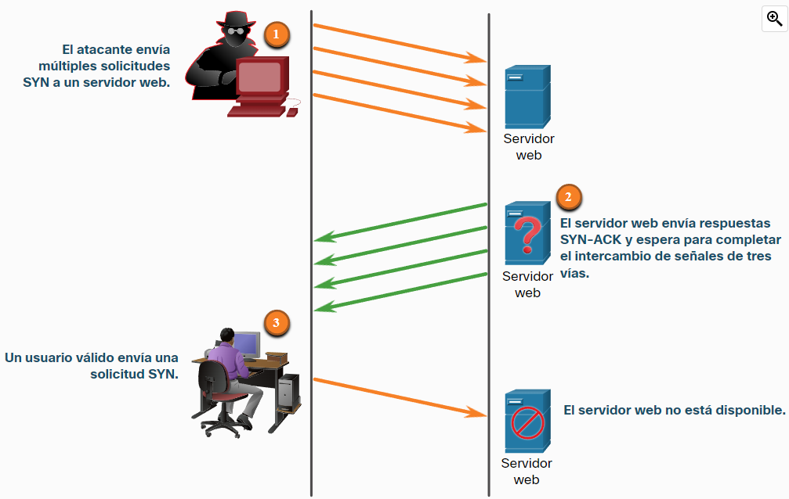

- **Saturación SYN a TCP**: en este tipo de ataque el atacante envía múltiples peticiones SYN (peticiones que inician el proceso para establecer una conexión [[TCP]]) con direcciones [[IP]] falsificadas haciendo [[Spoofing]].Esas peticiones nunca son respondidas y comienzan a acumularse conexiones TCP medio abiertas, lo que va agotante los recursos del servidor.
  
- **Ataque de restablecimiento a TCP**: un atacante podría terminar abruptamente una conexión TCP enviando un paquete con un bit RST.
- **Secuestro de sesiones TCP**: un atacante podría tomar el control de un host mientras este se comunica con otro y lograr enviar o interceptar informacion.