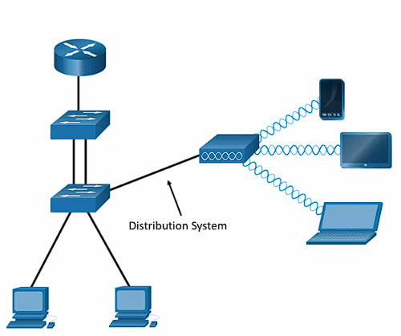
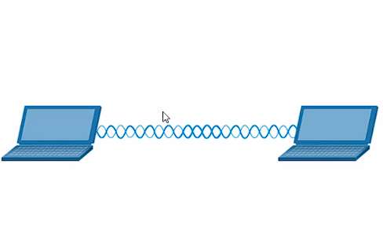
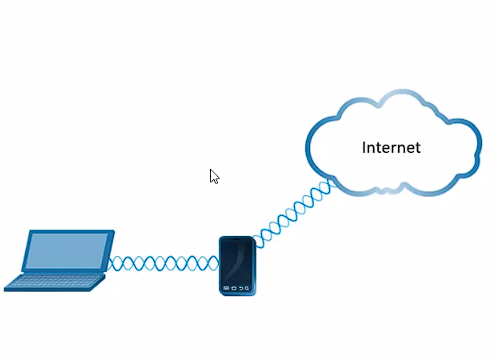

- una red pero inalámbrica, esto fue una revolución ya que ahora cualquier dispositivo en la red no tenia que estar conectado con un cable físico.
- estas utilizan radiofrecuencias en vez de cables.
- utilizan [[AP]] inalámbricos en vez de switches de ethernet
- estas pueden tener mas riesgos de seguridad ya que las frecuencias de radio pueden salir fuera de las instalaciones.
- una conexión inalámbrica puede venir de mucha maneras
- modo infraestructura donde el Router que conecta los dispositivos inalámbricos esta conectado a un red alámbrica.
  
- modo Ad hoc o P2P donde 2 dispositivos están conectados entre si sin necesidad de ningún Router.
  
- Tethering cuando un celular con conexión a datos móviles le comparte esta conexion a un dispositivo.
  
- las wlan utilzan muchos sistemas para logra esta maravilla que parece magia, la trama 802.11, CSMA/CA, etc veamos una conexión sencilla a un [[AP]].