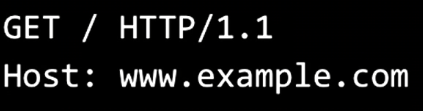
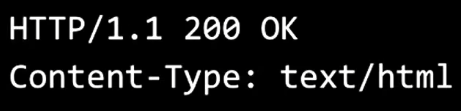

- Web development works with multiple protocols like [[TCP]],[[IP]] or [[HTTP]] basically your computer through your web browser sent a data package that contains literally "hey can you give me something of what you have on this address?" to another computer (webserver) and the Web server response you with a data package containing what you request or what you need to get the whole thing that you request!.
collapsed:: true
	- 
- Some examples like basic data package containing a request with [[HTTP]] protocol.
collapsed:: true
	- 
- or the data package containing the server response to that [HTTP] request:
collapsed:: true
	- 
- Oh man you really need to follow with the dalto JavaScript course and learn more about events
- you have to study a little more about how normal html forms work, an important thing is that when you click submit and you are using the "GET" method all the values that user write down will be in the URL after a "?" with a key: pair format, that doesn't happen with "POST". [[HTTP Methods]] look very interesting.
- The [[MVC Paradigm]]
- what is exactly a [[CDN]]?