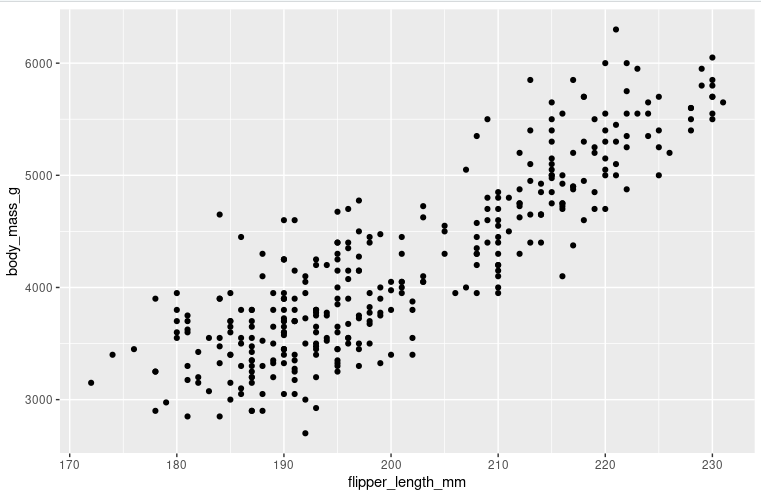
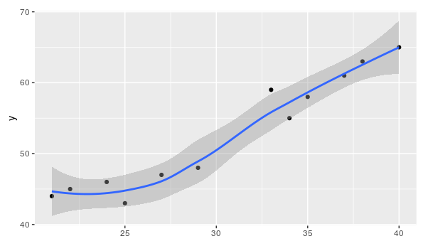

- es el paquete de visualización mas popular de R.
- Este cuanta con una estructura basada en [The Grammer Of Graphics](https://www.amazon.com/Grammar-Graphics-Statistics-Computing/dp/0387245448) de hay sus iniciales gg, parece un libro muy interesante, que ha influenciado bastante la visualización de datos y que valdría la leer.
- este tiene 4 elementos fundamentales:
  Aesthetic: Es el elemento que representa una propiedad visual de algún objeto de nuestro grafico, ósea son el color, tamaño, forma y demas.
- Geom: Que son las formas o marcas que seguramente recordaras de los fundamentos del [[Diseño De Visualizaciones]] que usamos para representar los datos en nuestro grafico, puntos, barras, porciones, líneas, etc.
- Facets: Que son como buckets para dividir un gran grafico en gráficos mas pequeños
- Labels: Todo el texto que le quieras poner a tu grafico.
- En ggplot todo comienza con la función ggplot la cual crea un espacio dimensional de 2 dimensiones parecido a un plano cartesiano, esta función acepta como parámetro el dataset que contiene la data que vivirá o será representada en ese espacio bidimensional.
- Luego a este objeto se puede sumar otra función llamada geom, con la cual podemos agregar la figura que vamos a utilizar para representar nuestros datos, de esta existen muchas variaciones como geom_point o geom_bar.
- Esta función de figura recibe una función de [[Mapeado]] que a su vez recibe un función llamada [[aes]]. para hacer un poco de abstracción el objetico de estas 2 ultimas es enlazar nuestra data con cierta característica visual, como a que eje están enlazadas, o a un rango de colores. por ejemplo si tienes unos datos que van del uno al 5 y esos datos los enlazas con un rango de colores del verde, entonces los datos se mostraran mas o menos verdes según el dato.
- Con esto en mente un código como este:
- ***Simple Scatter Plot *** #code
  ```R
  ggplot(data = penguins) + geom_point(mapping = aes(x=flipper_length_mm, y=body_mass_g))
  # init layer           +  data shape (with aesthetics)
  ggplot(data = penguins, mapping = aes(x=flipper_length_mm, y=body_mass_g)) + geom_point()
  # init layer aesthetics can go inside init layer too                      + data shape
  ```
  tendría este resultado
  
- mira esta  de referencia rápida para cualquier cosa que quieras hacer en ggplot2!
- otra función útil es la de suavizado la cual agrega la característica linea de tendencia que seguramente has visto en varios diagramas de dispersión/correlación 
  
- También podrían llegar a ser útiles las funciones facet con la que puedes dividir el grafico en gráficos mas pequeños según cualquier variable como hacer un group by directamente en la visualización.
- Con las funciónes labs() y annotate() podemos manejar todo lo que son anotaciones y títulos, la mayor diferencia entre estas es que la primera actúa fuera de los limites del grafico a su alrededor y la segunda dentro de ellos.